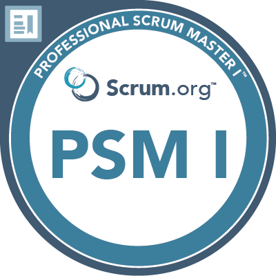

# Hi, my name is Jasbir Singh 👋

**Field of interests**: Software Development, Cyber Security, Artificial intelligence, Distributed Systems. 

### Skills 🛠️
- **Languages**:&nbsp;                         Python, Django, SQL
- **DS/ML/DL**:  &nbsp;&nbsp;                  SkLearn, PyTorch, TensorFlow
- **DevOps**:    &nbsp;&nbsp;&nbsp;&nbsp;      Linux, Git, Docker, Kubernetes 

### Work experience 👔
| Job Position           | Company         | Field                         | Work Period       |
| ---------------------- | --------------- | ----------------------------- | ----------------- |
| **Senior Software Developer**  | **Defense Station**  | **Full Stack development**      | **2023-05 — Present** |
| Engineer Technology | Iris Software Inc. | Full Stack development**  | 2021-05 — 2023-04 |
| Senior Technology Architect          | Just Dial     | Full Stack development         | 2020-09 — 2021-05 |
| Full Stack Engineer Tech Lead          | WGD Analytics Pvt Ltd     | Full Stack development | 2017-12 — 2020-09 |
| Software Analyst    | Stratbeans Consulting  | LMS development      | 2017-01 — 2017-07 |

### Education 🎓
- [Postgraduate Degree](https://github.com/jasbirnetwork) @ Loyalist College (2023 - current)
- [Bachelor's Degree](https://github.com/jasbirnetwork) @ CHANDIGARH UNIVERSITY (2013 - 2017)

### Certifications 📜
- [Professional Scrum Master™ I (PSM I)](https://www.credly.com/badges/0d81e0c9-7494-4bda-909c-87c0fb434e76/public_url) @ Scrum.org
- [AWS Certified Developer – Associate](https://www.credly.com/badges/61ef3973-ae75-45d2-a0df-18a7ddf72255/linked_in_profile) @ aws.amazon.com
- [Deep Learning](confirm.udacity.com/KNKXKFFQ) @ Udacity

### Achievements 🎯

  
More information in my [LinkedIn](https://www.linkedin.com/in/jasbirnetwork/) 🚀
